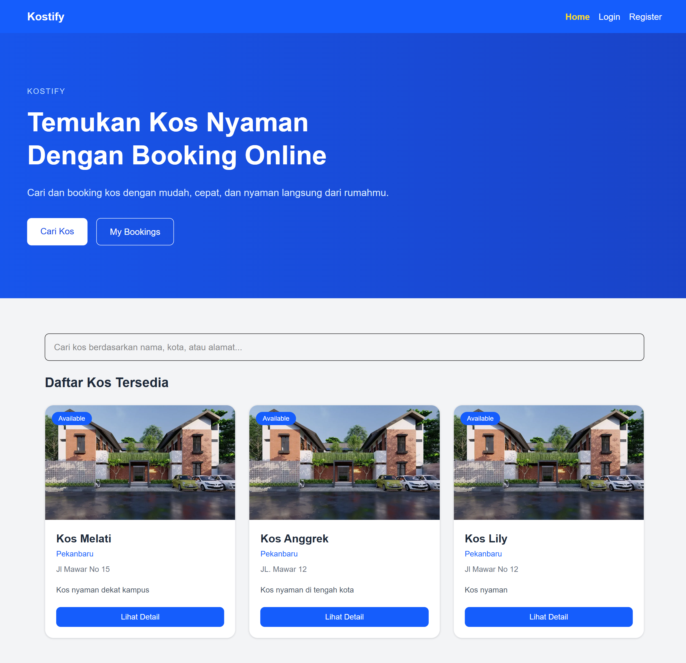
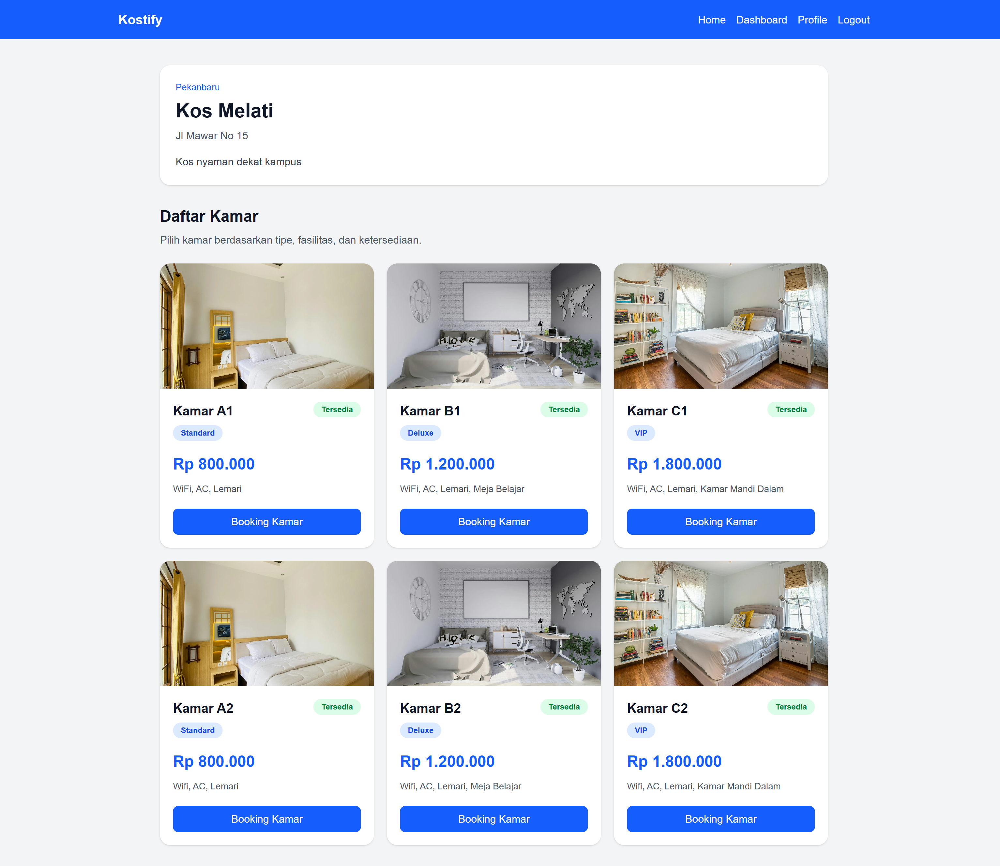

# Kostify Frontend

Kostify is a modern boarding house booking platform built with Next.js. This frontend provides user-facing pages for browsing kos, viewing room details, creating bookings, and accessing role-based pages for users and owners.

---

# Live Demo

## Frontend URL

https://crack-fe-fakhridhogunawan73.vercel.app/

## Backend API

https://crack-be-fakhridhogunawan73-production.up.railway.app

---

# Features

- Modern responsive homepage
- Browse kos list
- Search kos by name, city, and address
- Kos detail page
- Room listing
- Booking room flow
- Login page
- Register page
- Logout flow
- Protected pages
- Role-based navigation
- Owner dashboard access
- HTTP-only cookie authentication
- Axios API integration

---

# Tech Stack

- Next.js App Router
- TypeScript
- Tailwind CSS
- Axios
- Vercel Deployment

---

# Project Structure

```txt
src/
├── app/
│   ├── bookings/
│   ├── login/
│   ├── register/
│   ├── kos/
│   ├── owner/
│   └── page.tsx
├── components/
├── lib/
└── proxy.ts
```

---

# Environment Variables

Create .env.local file:

```txt
NEXT_PUBLIC_API_BASE_URL=
JWT_SECRET=
```

Example:

```txt
NEXT_PUBLIC_API_BASE_URL=https://your-backend-url.up.railway.app
JWT_SECRET=your_jwt_secret
```

## Notes

- NEXT_PUBLIC_API_BASE_URL is used to connect the frontend with the backend API.
- JWT_SECRET is used by proxy.ts to verify the authentication token for protected routes.

---

## Instalation

```txt
npm install
```

## Run Development Server

```txt
npm run dev
```

Open : http://localhost:3000

## Production Build

```txt
npm run build
npm run start
```

---

| Page               | Description                |
| ------------------ | -------------------------- |
| `/`                | Homepage and kos catalogue |
| `/login`           | User login                 |
| `/register`        | User registration          |
| `/kos/[id]`        | Kos detail and room list   |
| `/bookings/create` | Create booking             |
| `/my-bookings`     | User booking history       |
| `/owner/dashboard` | Owner dashboard            |
| `/profile`         | User profile               |

---

# Authentication Flow

Kostify uses HTTP-only cookie authentication.

## Flow

1. User logs in
2. Backend sends token inside HTTP-only cookie
3. Frontend sends requests using withCredentials
4. proxy.ts protects private routes
5. User can logout and the cookie is cleared by backend

## Roles

## USER

- Browse kos
- View room details
- Create booking
- View booking history

## OWNER

- Access owner dashboard
- Manage own kos
- Manage own rooms
- View booking requests

## ADMIN

- Full access to all resources

---

# Screenshoots

## Home



## Login

.png>)

## Register

.png>)

## Kos Detail



## Booking

.png>)

## Owner Dashboard

.png>)

# Related Links

## Backend Repository

https://github.com/Revou-FSSE-Oct25/crack-be-FakhridhoGunawan73

## Backend API

https://crack-be-fakhridhogunawan73-production.up.railway.app

## Presentation Slides

https://www.canva.com/design/DAHJu12PqdY/zG8URiKOvIAKniOWSsgsww/edit?utm_content=DAHJu12PqdY&utm_campaign=designshare&utm_medium=link2&utm_source=sharebutton

## Author

Fakhridho Gunawan
